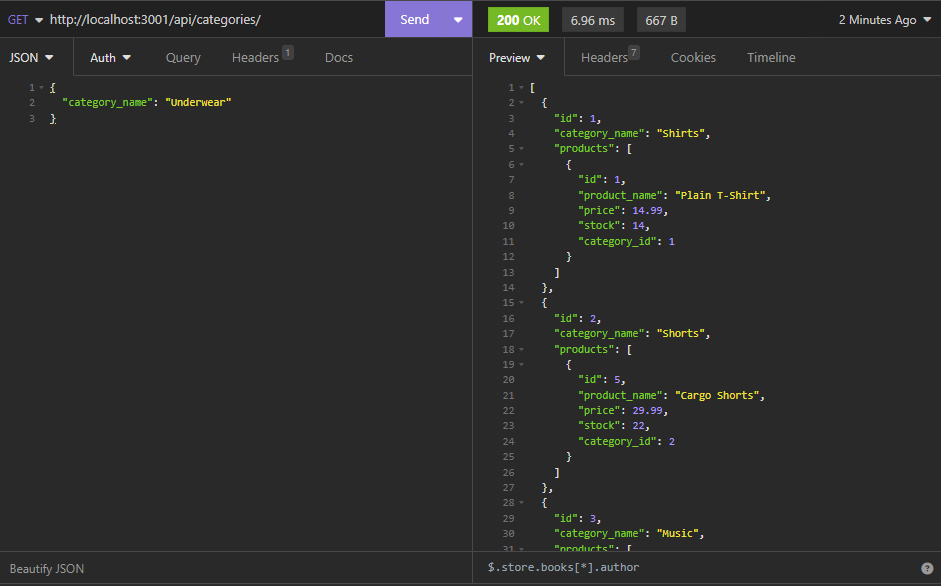

# E-commerce Backend

## Description

An e-commerce database using Sequelize to interact with a MySQL database.

## Features

GET, POST, PUT, DELETE Categories, Products, Tags, Product Tags

## Technologies Used

- JavaScript
- Node.js
- Sequelize
- SQL
- Express.js
- dotenv

## How to Use

Run 'node server.js' and test in Insomnia.

## Installation

Clone the repo to run locally.

npm run seed to ensure you have data to view.

## License

This project is licensed under the [MIT License](https://opensource.org/license/mit/).
